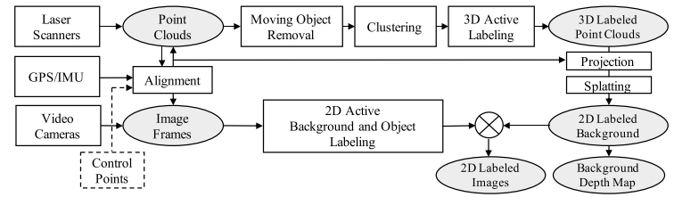

# Awesome Outdoor Multi-Sensor Datasets

## Multi-camara

1. [Cityscapes](https://www.cityscapes-dataset.com/)

   1. Preceding and trailing video frames. Each annotated image is the 20th image from a 30 frame video snippets (1.8s)
   2. Corresponding right stereo views
   3. GPS coordinates
   4. Ego-motion data from vehicle odometry
   5. Outside temperature from vehicle sensor

## Camera + Lidar

1. [KITTI](http://www.cvlibs.net/datasets/kitti/raw_data.php)
1. Raw (unsynced+unrectified) and processed (synced+rectified) grayscale stereo sequences (0.5 Megapixels, stored in png format)
   2. Raw (unsynced+unrectified) and processed (synced+rectified) color stereo sequences (0.5 Megapixels, stored in png format)
   3. 3D Velodyne point clouds (100k points per frame, stored as binary float matrix)
   4. 3D GPS/IMU data (location, speed, acceleration, meta information, stored as text file)
   5. Calibration (Camera, Camera-to-GPS/IMU, Camera-to-Velodyne, stored as text file)
   6. 3D object tracklet labels (cars, trucks, trams, pedestrians, cyclists, stored as xml file)

2. [PeRL](http://robots.engin.umich.edu/SoftwareData/Ford)
   1. a professional (Applanix POS LV) and consumer (Xsens MTI-G) Inertial Measuring Unit (IMU)
   2. a Velodyne 3D-lidar scanner
   3. two push-broom forward looking Riegl lidars
   4. Point Grey Ladybug3 omnidirectional camera system

3. [Málaga](https://www.mrpt.org/MalagaUrbanDataset)

   1. Stereo camera
   2. IMU, GPS
   3. 2xSICK LMS
   4. 3xHOKUYO

4. [Rawseeds](http://www.rawseeds.org/home/)

   - [Bicocca (indoor)](http://www.rawseeds.org/rs/datasets/view/6)

     1. [Ultrasound transducers](http://www.rawseeds.org/home/2007/12/15/ultrasonic-sensors/)
     2. Inertial measurement unit
     3. Onboard camera systems: binocular and trinocular black-and-white (B/W) vision; normal perspective, color and B/W cameras; omnidirectional color vision with hyperbolic mirror
     4. Laser range finders
     	- Short-range (4m range, less at low reflectivity), cheap LRF. We use two Hokuyo URG-04LX LRFs. 
     	- Medium- and long-range (respectively <30m and <100m range at 100% reflectivity) high-performance LRFs. We use Sick LMS200 and LMS291. 
   - [Bovisa (outdoor + mixed)](http://www.rawseeds.org/rs/datasets/view/7)
     1. Inertial measurement unit
     2. Onboard camera systems: binocular and trinocular black-and-white (B/W) vision; normal perspective, color and B/W cameras; omnidirectional color vision with hyperbolic mirror
     3. Laser range finders
        - Short-range (4m range, less at low reflectivity), cheap LRF. We use two Hokuyo URG-04LX LRFs. 
        - Medium- and long-range (respectively <30m and <100m range at 100% reflectivity) high-performance LRFs. We use Sick LMS200 and LMS291. 

5. [Lyft](https://self-driving.lyft.com/level5/data/)

   1. 7 cameras – covering a 360 view around the car
   2. 3 LIDAR sensors, 2 placed in the front part and one on the car’s roof

6. [ApolloScape](http://apolloscape.auto/)

   

   1. two VUX-1HA laser scanners
   2. one VMX-CS6 camera system (two front cameras are used with resolution 3384 × 2710)
   3. IMU & GNSS

7. [Waymo Open](https://waymo.com/open)

   1. 1 mid-range lidar
   2. 4 short-range lidars
   3. 5 cameras (front and sides)
   4. Synchronized lidar and camera data
   5. Lidar to camera projections
   6. Sensor calibrations and vehicle poses

8. [DARPA Urban Dataset](http://grandchallenge.mit.edu/wiki/index.php?title=PublicData)

   1. Applanix POS-LV 220 GPS/INS
   2. 12 SICK LMS 291-S05 LIDARs
   3. Velodyne HDL-64e LIDAR
   4. 5 Point Grey Firefly MV Firewire cameras

9. [Urban Data Set (kaist.ac.kr)](https://irap.kaist.ac.kr/dataset/system.html)

   1. 2 Stereo Camera
   2. 2 3D LiDAR
   3. 2 2D LiDAR
   4. GPS
   5. VRS GPS
   6. 3-axis FOG
   7. IMU
   8. 2 Wheel Encoder
   9. Altimeter

10. [Honda Research Institute Driving Dataset](https://usa.honda-ri.com/hdd)

    1. 3 x Point Grey Grasshopper 3 video camera, resolution: 1920 1200 pixels, frame rate: 30Hz, field of view (FOV): 80 degrees x 1 (center) and 90 degrees x 2 (left and right).
    2. 1 x Velodyne HDL-64E S2 3D LiDAR sensor, spin rate: 10 Hz, number of laser channel: 64, range: 100 m, horizontal FOV: 360 degrees, vertical FOV: 26.9 degrees.
    3. 1 x GeneSys Eletronik GmbH Automotive Dynamic Motion Analyzer with DGPS outputs gyros, accelerometers and GPS signals at 120 Hz.
    4. a Vehicle Controller Area Network (CAN) that provides various signals from around the vehicle. We recorded throttle angle, brake pressure, steering angle, yaw rate and speed at 100 Hz.

11. [Argoverse](https://www.argoverse.org/data.html)

    1. 2 roof-mounted LiDAR sensors
    2. Seven high-resolution ring cameras (1920 x 1200) recording at 30 Hz with a combined 360° field of view
    3. Two front-view facing stereo cameras (2056 x 2464) sampled at 5 Hz

12. [ASTAR-3D](https://github.com/I2RDL2/ASTAR-3D#Dataset)

    1. Two PointGrey Chameleon3 USB3 Global shutter color cameras (CM3-U3-31S4C-CS) with 55Hz frame rate, 2048 × 1536 resolution.
    2. A Velodyne HDL-64ES3 3D-LiDAR with 10Hz spinrate, 64 laser beams.

## Camera + Lidar + Radar

1. [The Oxford Radar RobotCar Dataset](https://ieeexplore.ieee.org/abstract/document/9196884)

   1. 1 × Navtech CTS350-X Millimetre-Wave FMCW radar, 4 Hz, 400 measurements per rotation, 163 m range, 4.38 cm range resolution, 1.8° beamwidth
   2. 2 × Velodyne HDL-32E 3D LIDAR, 360° HFoV, 41.3° VFoV, 32 planes, 20 Hz, 100 m range, 2 cm range resolution
   3. 1 × Point Grey Bumblebee XB3 (BBX3-13S2C- 38) trinocular stereo camera, 1280×960×3, 16 Hz, 1/3″ Sony ICX445 CCD, global shutter, 3.8 mm lens, 66° HFoV, 12/24 cm baseline
   4. 3 × Point Grey Grasshopper2 (GS2-FW-14S5C-C) monocular camera, 1024×1024, 11.1 Hz, 2/3″ Sony ICX285 CCD, global shutter, 2.67 mm fisheye lens (Sunex DSL315B-650-F2.3), 180° HFoV
   5. 2 × SICK LMS-151 2D LIDAR, 270° FoV, 50 Hz, 50 m range, 0.5° resolution
   6. 1 × NovAtel SPAN-CPT ALIGN inertial and GPS navigation system, 6 axis, 50 Hz, GPS/GLONASS, dual antenna

2. [nuScenes](https://www.nuscenes.org/)

   1. 1x spinning LIDAR
   2. 5x long range RADAR sensor
   3. 6x camera
   4. GPS & IMU

## Camera + Thermal + LiDAR

1. [KAIST Multi-spectral](https://sites.google.com/view/multispectral/home)
   1. a co-aligned RGB/Thermal camera, 
   2. RGB stereo, 
   3. 3D LiDAR
   4. inertial sensors (GPS/IMU)
   5. a related calibration technique