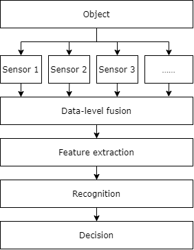
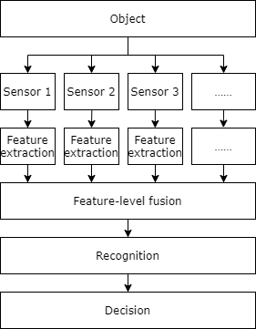
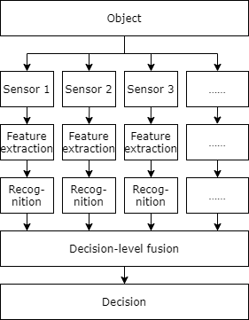

# Multi-sensor Information fusion, MSIF

Information fusion techniques can integrate a large amount of data and knowledge, representing the same real-world object, and obtain a consistent, accurate and useful representation of that object. These data may be independent or redundant and can be obtained by different sensors at the same time, or at different times. A suitable combination of investigative methods can substantially increase the profit of information in comparison with that from a single sensor.

## Background

### The main difficulties of multimodal fusion

1. **Sensor viewing angle problem**

    The 3D-CVF (ECCV20) research puts forward the biggest problem of fusion and fusion work, which is the problem of viewing angle, which is described as the problem shown in the figure. The information obtained by the camera is the principle of “Pinhole imaging”. It is information obtained from a viewing cone, while lidar is information obtained in a real 3D world. This makes a big difference in the representation of the same object.

    

2. **Data representation is not the same**

    The image information is dense and ordered, but the point cloud information is sparse and disordered. Therefore, feature fusion in the feature layer or input layer will cause difficulty in fusion positioning due to different domains.

    - Camera: RGB image pixel array;
    - Lidar: 3D point cloud distance information (possibly gray value with reflection value);
    - GPS-IMU: body position and attitude information;
    - Radar: 2D reflection map.
3. **The difficulty of information fusion**

    In theory, image information is dense and ordered, and contains rich color information and texture information, but the disadvantage is that it is two-dimensional information. There is a scale problem due to distance. Relative to the image, the expression of the point cloud is sparse and irregular, which makes it impossible to directly process the point cloud using traditional CNN perception. However, the point cloud contains three-dimensional geometric structure and depth information, which is more beneficial for 3D target detection, so the two information is theoretically complementary. In addition, in the current two-dimensional image detection, the deep learning methods are all based on CNN. In the point cloud target detection, there are networks designed with multiple infrastructures such as MLP, CNN, and GCN.

### The link between point cloud and image

The image information and the point cloud information must be connected in order to be fused accordingly. As far as the feature layer or the input layer is concerned, this connection comes from a cognition, that is: for a lidar or a camera, the scan of the same object at the same time is the same object at this time. The only difference is the form of representation, and the link that integrates this information is the absolute coordinates, which means that although the coordinates in the world coordinate system where the camera and the lidar are located are different, they scan the same object at the same time They are only scanning under the sensor coordinate system, so only need to know the position transformation matrix between the lidar and the camera, you can easily get the coordinate conversion between the coordinate systems of the two sensors so that the scanned The object can also be used as the link of feature connection through its coordinates under the two sensors.

However, as far as the link is concerned, since the size of the feature-map or domain may change during the feature extraction process, the original coordinates will also change to a certain extent, which is also a problem that needs to be studied.

## Fusion Level

### Data-level fusion (early-level)

Directly fuse the raw data of multiple sensors, and then extract feature vectors from the fused data.

Data-level fusion requires multiple sensors to be **homogeneous** (the sensors are observing the same physical quantity), otherwise, **calibration** is required.

Data-level fusion does not have the problem of data loss, and the results are accurate; but the amount of calculation is large, and the requirement for system **communication** is high.

### Feature-level fusion (deep-level)

First extract the **representative features** from the original observation data provided by each sensor, and then fuse these features into a single feature vector.

Selecting the appropriate **feature** for fusion is the important; feature information includes edge, direction, speed, shape, etc.

1. **State fusion**: Mainly used in the field of **multi-sensor target tracking**; the fusion system first preprocesses sensor data to complete **data registration**. After data registration, the fusion processing mainly realizes parameter association and state estimation.
2. **Feature fusion**: the joint **recognition** of the feature layer. It is the problem of **pattern recognition**; before fusion, the features must be associated to the same **representation** and then classified into meaningful combinations; 

Feature-level fusion has developed relatively well, and because a set of effective feature correlation technologies have been established in **the feature layer**, the **consistency** of the fusion information can be guaranteed; this level of fusion has relatively **low requirements for calculation and communication**, but the abandonment of part of the data reduces its **accuracy**.

It is divided into **point-based multi-modal feature fusion** and **voxel-based multi-modal feature fusion**. The difference is whether lidar-backbone is based on voxel or point. As far as the author understands, the voxel-based method can use the powerful voxel-based backbone (in the article Part-A^2 of the article TPAMI20, the point-based method and the voxel-based method have been studied. The biggest difference is that CNN and CNN is superior to MLP in the perception of MLP). However, if the voxel-backbone method is used, it will be necessary to consider the change of the point-to-image mapping relationship, because the point-based method uses the original point cloud coordinates as the feature carrier, but the voxel-based method uses the voxel center as the CNN perception feature carrier , And the index of the voxel center and the original image is deviated from the coordinate index of the original point cloud to the image.

**The point-based method has the advantage of having the index of the image and not having the spatial change, while the voxel method can more effectively use the perceptual ability of convolution**

1. **voxel-based**

    ***3D-CVF: Generating Joint Camera and LiDAR Features Using Cross-View Spatial Feature Fusion for 3D Object Detection.***

    In the feature fusion stage, this method uses voxel-based method to extract the features of the point cloud while fusing the features. Therefore, the core problem that needs to be solved here is that besides considering how to do feature fusion, we also need to consider the deviation of voxel-center as a feature carrier from the original point cloud coordinates. Another problem solved in this paper is how to index the image information to the voxel center coordinates with deviation.

    **3D-CVF feature fusion method**

    When 3D-CVF converts the pixel of the camera to the BEV view of the point cloud (voxel-feature-map), the converted size is twice the size of the xy of lidar-voxel-feature-map, that is to say the overall voxel The number is four times that of Lidar, which means it will contain more detailed information.

    **Auto-Calibrated Projection Method**

    1. Project to get a camera-plane, which is the expression of voxel-dense from image features to bev perspective.
    2. Project the voxel center divided by lidar onto the camera-plane (with an offset, not necessarily the center of the coordinate grid).
    3. Using nearest neighbor interpolation, interpolate the image features of the nearest 4 pixels to a lidar-voxel.
2. **point-based**

    Since the point-based method is also based on the original point as the carrier in the feature extraction process (the encoder-decoder structure will first reduce the number of points and then increase but the points are sampled from the original points, for the GCN structure, the number of points does not change), so when doing feature fusion, the index of the aforementioned transformation matrix can be directly used for the feature fusion in the absolute coordinate system.

    ***PI-RCNN: An Efficient Multi-sensor 3D Object Detector with Point-based Attentive Cont-conv Fusion Module.***

    The point branch and the image branch are used for 3D target detection tasks and semantic segmentation tasks respectively, and then the features of image semantic segmentation are added to the internal point cloud of proposals through the index for secondary optimization.

    ***PointPainting: Sequential Fusion for 3D Object Detection***

    The two-dimensional semantic segmentation information is fused to the point through the transformation matrix of lidar information and image information, and then baseline object detection is used; it can be understood that the semantically segmented objects have more information as a guide to obtain better detection accuracy. The difference from the above pi-rcnn is that the fusion is a series network structure, which sends the semantically segmented features and the original point cloud into the deep learning network.

    ***EPNet: Enhancing Point Features with Image Semantics for 3D Object Detection***

    The point cloud branch of its network structure is a point encoder-decoder structure, and the image branch is a network of gradual encoders, and feature fusion is done layer by layer.

### Decision-level fusion (late-level)

It is a high-level abstraction of data, and the output is the result of a **joint decision**. In theory, this joint decision should be more precise or clearer than any single sensor decision.

Decision-level fusion has high **flexibility** in information processing. The system requires very low bandwidth for information **transmission**. It can effectively integrate different types of information reflecting the environment or various sides of the target, and it can process **asynchronous** information.

Due to the time-varying dynamic characteristics of the environment and goals, the difficulty of acquiring prior knowledge, the huge characteristics of the knowledge base, the object-oriented system design requirements, etc., the development of decision-level fusion theory and technology is still subject to certain restrictions.

***CLOCs: Camera-LiDAR Object Candidates Fusion for 3D Object Detection***

1. 2D and 3D target detectors propose proposals respectively
2. Encode the proposals of the two modalities into a sparse tensor
3. For non-empty elements, two-dimensional convolution is used for corresponding feature fusion.

## Prerequisites for MSIF

### Motion compensation

1. **ego motion**

    The sensor is in a certain time stamp during the collection process, due to the movement of the vehicle itself, the collected object will undergo a relative displacement change within the time stamp.

2. **motion from others**

### Synchronization

1. **Hardware synchronization**

    Use the same hardware to issue trigger acquisition commands at the same time to achieve time synchronization of sensor acquisition and measurement. Collect the same information at the same time.

2. **Software synchronization: time synchronization, space synchronization.**
    1. **Time synchronization**

        The unified host provides the reference time for each sensor, and each sensor adds time stamp information to the data collected independently according to the respective time after calibration. The time stamp of all sensors can be synchronized, but the collection period of each sensor is independent of each other. , There is no guarantee that the same information will be collected at the same time

    2. **Space synchronization**

        Convert the measured values of different sensor coordinate systems to the same **coordinate system**, where the laser sensor needs to consider the intra-frame displacement **calibration** at the current speed when the laser sensor moves at a high speed.