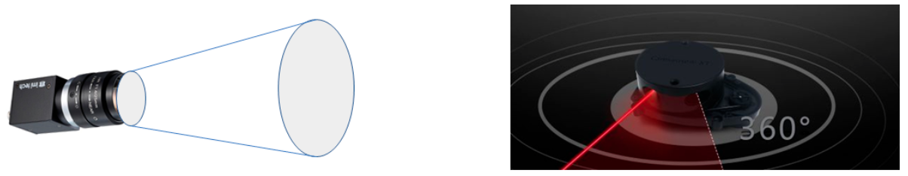
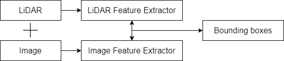
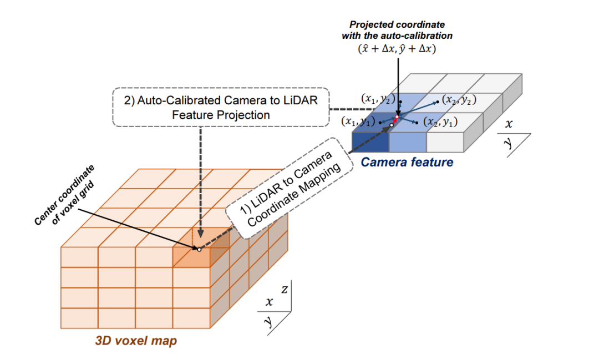

# Multimodal fusion

## Background

### The main difficulties of multimodal fusion

#### Sensor viewing angle problem

The 3D-CVF (ECCV20) research puts forward the biggest problem of fusion and fusion work, which is the problem of viewing angle, which is described as the problem shown in the figure. The information obtained by the camera is the principle of "Pinhole imaging". It is information obtained from a viewing cone, while lidar is information obtained in a real 3D world. This makes a big difference in the representation of the same object.

#### Data representation is not the same

The image information is dense and ordered, but the point cloud information is sparse and disordered. Therefore, feature fusion in the feature layer or input layer will cause difficulty in fusion positioning due to different domains.

#### The difficulty of information fusion

In theory, image information is dense and ordered, and contains rich color information and texture information, but the disadvantage is that it is two-dimensional information. There is a scale problem due to distance. Relative to the image, the expression of the point cloud is sparse and irregular, which makes it impossible to directly process the point cloud using traditional CNN perception. However, the point cloud contains three-dimensional geometric structure and depth information, which is more beneficial for 3D target detection, so the two information is theoretically complementary. In addition, in the current two-dimensional image detection, the deep learning methods are all based on CNN. In the point cloud target detection, there are networks designed with multiple infrastructures such as MLP, CNN, and GCN. 

### The link between point cloud and image

The image information and the point cloud information must be connected in order to be fused accordingly. As far as the feature layer or the input layer is concerned, this connection comes from a cognition, that is: for a lidar or a camera, the scan of the same object at the same time is the same object at this time. The only difference is the form of representation, and the link that integrates this information is the absolute coordinates, which means that although the coordinates in the world coordinate system where the camera and the lidar are located are different, they scan the same object at the same time They are only scanning under the sensor coordinate system, so only need to know the position transformation matrix between the lidar and the camera, you can easily get the coordinate conversion between the coordinate systems of the two sensors so that the scanned The object can also be used as the link of feature connection through its coordinates under the two sensors.

However, as far as the link is concerned, since the size of the feature-map or domain may change during the feature extraction process, the original coordinates will also change to a certain extent, which is also a problem that needs to be studied.

## Some fusion methods

### early-fusion & deep-fusion - Feature Fusion Method

This fusion requires certain interactions in the feature layer. The main fusion method is to use feature extractors for both lidar and image branches, and the network of image branches and lidar branches is fused at a semantic level in the feedforward level to achieve semantic fusion of multi-scale information.

It is divided into **point-based multi-modal feature fusion** and **voxel-based multi-modal feature fusion**. The difference is whether lidar-backbone is based on voxel or point. As far as the author understands, the voxel-based method can use the powerful voxel-based backbone (in the article Part-A^2 of the article TPAMI20, the point-based method and the voxel-based method have been studied. The biggest difference is that CNN and CNN is superior to MLP in the perception of MLP). However, if the voxel-backbone method is used, it will be necessary to consider the change of the point-to-image mapping relationship, because the point-based method uses the original point cloud coordinates as the feature carrier, but the voxel-based method uses the voxel center as the CNN perception feature carrier , And the index of the voxel center and the original image is deviated from the coordinate index of the original point cloud to the image.

**The point-based method has the advantage of having the index of the image and not having the spatial change, while the voxel method can more effectively use the perceptual ability of convolution**

#### voxel-based

[3D-CVF: Generating Joint Camera and LiDAR Features Using Cross-View Spatial Feature Fusion for 3D Object Detection.](https://arxiv.org/pdf/2004.12636)

In the feature fusion stage, this method uses voxel-based method to extract the features of the point cloud while fusing the features. Therefore, the core problem that needs to be solved here is that besides considering how to do feature fusion, we also need to consider the deviation of voxel-center as a feature carrier from the original point cloud coordinates.
Another problem solved in this paper is how to index the image information to the voxel center coordinates with deviation.

**3D-CVF feature fusion method**

When 3D-CVF converts the pixel of the camera to the BEV view of the point cloud (voxel-feature-map), the converted size is twice the size of the xy of lidar-voxel-feature-map, that is to say the overall voxel The number is four times that of Lidar, which means it will contain more detailed information.

**Auto-Calibrated Projection Method**

1. Project to get a camera-plane, which is the expression of voxel-dense from image features to bev perspective.
2. Project the voxel center divided by lidar onto the camera-plane (with an offset, not necessarily the center of the coordinate grid).
3. Using nearest neighbor interpolation, interpolate the image features of the nearest 4 pixels to a lidar-voxel. 

#### point-based

Since the point-based method is also based on the original point as the carrier in the feature extraction process (the encoder-decoder structure will first reduce the number of points and then increase but the points are sampled from the original points, for the GCN structure, the number of points does not change), so when doing feature fusion, the index of the aforementioned transformation matrix can be directly used for the feature fusion in the absolute coordinate system.

[PI-RCNN: An Efficient Multi-sensor 3D Object Detector with Point-based Attentive Cont-conv Fusion Module.](https://arxiv.org/pdf/1911.06084)

The point branch and the image branch are used for 3D target detection tasks and semantic segmentation tasks respectively, and then the features of image semantic segmentation are added to the internal point cloud of proposals through the index for secondary optimization.

[PointPainting: Sequential Fusion for 3D Object Detection](https://arxiv.org/pdf/1911.10150)

The two-dimensional semantic segmentation information is fused to the point through the transformation matrix of lidar information and image information, and then baseline object detection is used; it can be understood that the semantically segmented objects have more information as a guide to obtain better detection accuracy. The difference from the above pi-rcnn is that the fusion is a series network structure, which sends the semantically segmented features and the original point cloud into the deep learning network.

[EPNet: Enhancing Point Features with Image Semantics for 3D Object Detection](https://arxiv.org/pdf/2007.08856)

The point cloud branch of its network structure is a point encoder-decoder structure, and the image branch is a network of gradual encoders, and feature fusion is done layer by layer.

### late-fusion

Fusion at the decision-making level is relatively simple, and there is no need to consider fusion and complementarity at the information level. That is to say, as long as the two networks do the same task, then after obtaining the respective results, the results are selected for decision fusion.

[CLOCs: Camera-LiDAR Object Candidates Fusion for 3D Object Detection](https://arxiv.org/pdf/2009.00784.pdf)

1. 2D and 3D target detectors propose proposals respectively
2. Encode the proposals of the two modalities into a sparse tensor
3. For non-empty elements, two-dimensional convolution is used for corresponding feature fusion.

## From multi-view multi-camera: Traditional + deep learning

[Multiview detection with feature perspective transformation, ECCV 2020](https://hou-yz.github.io/publication/2020-eccv2020-mvdet)

There is a clear ground plane for outdoor scenes. In such a scene, most of the objects we are interested in are on the ground, so we can use this assumption to restore the monocular information back to 3D space. In this way, the multi-view data can be integrated in a unified 3D space. One application is multi-view pedestrian detection.

The input in this task is images of the same scene in different cameras, hoping to eventually output a pedestrian occupancy grid under BEV. First of all, when the parameters of each camera are known and each point is assumed to be on the ground plane, we can transform each image into a trapezoidal area projected under BEV through perspective transformation, as shown in the following figure. We can project the multi-view data into the same BEV space to solve hard cases such as occlusion and small objects in the distance.

[Predicting Semantic Map Representations from Images using Pyramid Occupancy Networks. CVPR 2020](https://arxiv.org/abs/2003.13402)

This paper uses a car camera to do BEV semantic segmentation (semantic occupancy grid). Unlike the above work that directly changes a single feature map, this work makes full use of the multi-scale information of the results like FPN, so that feature maps of different scales correspond to features at different distances: intuitively, higher resolution The feature map should be responsible for generating the BEV feature in the distance, while the nearby BEV feature should be generated from the low-resolution feature map. Here, the author makes a hard division based on distance. As shown in the following flowchart:

Combining the principle of camera imaging with the powerful representation capabilities of CNN is a very interesting research direction. We can combine some basic 3D computer vision knowledge into the transform and aggregate of the feature map in CNN to enhance the image features under a single perspective. I believe that more applications can benefit from this idea.

## Resources

https://github.com/tyjiang1997/awesome-Automanous-3D-detection-methods