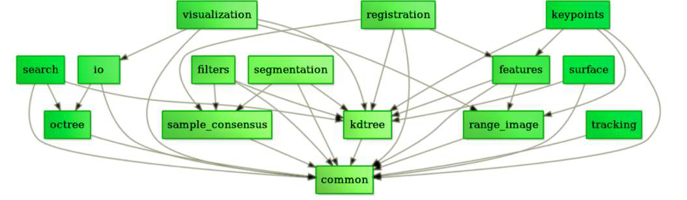

# Point Clouds

## Introduction

### Content

#### Laser measurement

1. Three-dimensional coordinates (XYZ)

2. Laser reflection intensity

    1. surface material

	2. roughness

	3. incident angle direction of the target

	4. the emission energy of the instrument

	5. laser wavelength

#### Photogrammetry

1. Three-dimensional coordinates (XYZ)

2. Color information (RGB)

#### Laser measurement and photogrammetry

1. Three-dimensional coordinates (XYZ)

2. Laser reflection intensity

3. Color information (RGB)

### Attributes

1. Spatial resolution

2. Point accuracy

3. Surface normal vector

## Acquisition

| Acquisition       |         | Point density                                                                                         | Advantages                                                                                  | Disadvantages                                                                                                                                                                                                                                        | Applications                                                              |
| ----------------- | ------- | ----------------------------------------------------------------------------------------------------- | ------------------------------------------------------------------------------------------- | ---------------------------------------------------------------------------------------------------------------------------------------------------------------------------------------------------------------------------------------------------- | ------------------------------------------------------------------------- |
| **Image-derived** |         | From Sparse to extremely high, depends on the spatial resolution   of the stereo or multi view images | With color (RGB, multi-spectral) information; suitable for large area(airborne, spaceborne) | Influenced by light;     Depends on camera, image matching algorithms, stereo angles, image resolutions, and image quality;     Not suitable for areas or objects without texture, such as water or snow-covered regions;     Influenced by shadows. | Urban monitoring;     Vegetation monitoring;     3D object reconstruction |
| **LiDAR**         | **ALS** | Sparse                                                                                                | High accuracy (<15cm); suitable for large area; not affected by weather                     | Expensive;     affected by mirror reflection;     Long scanning time.                                                                                                                                                                                | Urban monitoring;     Vegetation monitoring;     Power line detection     |
|                   | **MLS** | Dense, the smaller the survey distance, the higher the density                                        | High accuracy (cm-level)                                                                    |                                                                                                                                                                                                                                                      | Mapping;     Urban monitoring                                             |
|                   | **TLS** | Dense, the smaller the survey distance, the higher the density                                        | High accuracy (mm-level)                                                                    |                                                                                                                                                                                                                                                      | Small area 3D reconstruction                                              |
|                   | **ULS** | Dense, the smaller the survey distance, the higher the density                                        | High accuracy (cm-level)                                                                    |                                                                                                                                                                                                                                                      | Forestry survey;     Mining survey;     Disaster monitoring               |
| **RGB-D**         |         | Middle density                                                                                        | Cheap; flexible                                                                             | Close range;  Limited accuracy                                                                                                                                                                                                                       | Indoor reconstruction;     Object tracking;     Human pose recognition    |
| **InSAR**         |         | Sparse                                                                                                | Global data is available                                                                    | Expensive;     Ghost scatterers;     Pre-processing                                                                                                                                                                                                  | Urban monitoring;     Forest monitoring                                   |

### Image-derived

1. Dense matching
2. Multi-view stereo vision (MVS)
3. Structure from Motion (SfM)

### LiDAR

In lidar scanning, since the system always moves with the platform, the position of the point cloud needs to be combined with the global navigation satellite system (GNSS) and inertial measurement unit (IMU) data to ensure high-quality point cloud matching.

#### ALS - Airborne lidar scanning

ALS point cloud is more expensive to obtain and usually does not contain spectral information.

Multispectral airborne lidar is a special form of ALS system, which uses different wavelengths to acquire data. Multispectral lidar performs well in extracting water, vegetation, and shadows, but the data is hard to obtain.

#### MLS - Moving lidar scanning

Running on a moving vehicle on the ground, the most common platform is a car.

#### TLS

Static lidar scanning using a fixed sensor mounted on a tripod for scanning. Because it is used in medium and short distance environments, the point cloud density is very high. It can provide real, high-quality 3D models

#### ULS

Usually deployed on drones or other unmanned aerial vehicles. Relatively cheap and very flexible.

### [RGB-D](RGBDOD.md)

An RGB-D camera is a sensor that can simultaneously acquire RGB and depth information.

1. Stereo triangulation
2. Sheet of light triangulation
3. Structured light
4. Time-of-flight
5. Interferometry
6. Coded aperture

In RGB-D cameras, the relative orientation elements between different sensors or between sensors are calibrated and known, so it is easy to obtain co-registered synchronized RGB images and depth maps.

### InSAR

Interferometric Synthetic Aperture Radar

## Processing

Read [Point Cloud Library][1].

**Marr's three levels**

### Low-Level processing

#### Image enhancement/filtering

1. Bilateral filtering
2. Gaussian filtering
3. Conditional filtering
4. Low/high pass filter
5. Random Filters for Compressive Sampling

#### Key point/edge detection

1. ISS3D

2. Harris3D
3. NARF
4. SIFT3D

### Mid-Level Processing

#### Feature description

1. Normal and curvature
2. Eigenvalue analysis
3. [SHOT](http://www.vision.deis.unibo.it/research/80-shot)
4. [PFH](https://ieeexplore.ieee.org/document/4650967)
5. [FPFH](https://ieeexplore.ieee.org/document/4650967)
6. 3D Shape Context
7. Spin Image

#### Point cloud segmentation

[Point Cloud Segmentation](PointCloudSegmentation.md)

1. Regional growth
2. Ransac
3. Global optimization
4. K-Means
5. Normalize Cut (Context-based)
6. 3D Hough Transform
7. Connectivity analysis

#### Point cloud classification

1. Point-based classification
2. Segmentation-based classification
3. Classification based on deep learning

### High-Level Processing

#### Registration

##### Coarse Registration

Minimize the difference in spatial position between point clouds based on coarse registration.

1. [ICP](https://ieeexplore.ieee.org/document/121791) :  iterative closest point 
2. Robust ICP
3. point to plane ICP
4. Point to line ICP
5. MBICP
6. GICP
7. NICP

##### Fine Registration

Register the point cloud when the relative pose of the point cloud is unknown

###### Registration algorithm based on exhaustive search

Traverse the entire transformation space to select the transformation relationship that minimizes the error function or List the transformation relations that satisfy the most point pairs.

1. RANSAC
2. 4-Point Congruent Set
3. Super4PCS

###### Registration algorithm based on feature matching

Construct the matching correspondence between the point clouds through the morphological characteristics of the measured object itself, and then use the relevant algorithm to estimate the transformation relationship.

#### Three-dimensional reconstruction

#### Point cloud data management

1. Point cloud compression
2. Point cloud index
3. Point cloud LOD
4. Massive point cloud rendering.

[1]:https://pcl.readthedocs.io/projects/tutorials/en/latest/