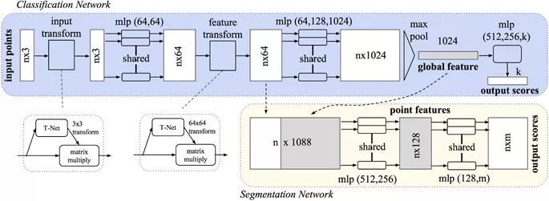

# Point Cloud Segmentation

## Traditional segmentation methods based on point clouds

The main process of Point Cloud Segmentation is to group the original 3D points into non-overlapping areas. These areas correspond to specific structures or objects in a scene. Since this segmentation process does not require supervised prior knowledge, the results obtained do not have strong semantic information.

### Edge-based segmentation

The edge-based PCS method converts the two-dimensional image-based method directly into a three-dimensional point cloud. This method is mainly used in the early stage of PCS. Since the shape of the object is described by the edge, it can be found by looking for the area close to the edge. The principle of the edge-based method is to locate the points with rapid changes in brightness, which is similar to some two-dimensional image segmentation methods.

There are two main steps:

1. Edge detection, extract the boundaries of different regions
2. Edge point grouping, generate the final segmentation by grouping the points within the boundary in 1.

It runs fast, but it can only maintain good performance when providing simple scenes with ideal points (such as low noise, uniform density). Some of these methods are only suitable for depth images and not for 3D points. Therefore, this method is currently rarely applied to dense and/or large-area point cloud data sets.

### Segmentation based on regional growth

It combines features between two points or two area units to measure the similarity between pixels (2D), points (3D) or voxels (3D), and merges them together (if they are in Close in space and have similar surface characteristics).

Three-dimensional region growth involves two steps:

1. Select seed point or seed unit;
2. Regional growth is driven by certain principles. When designing an area growth algorithm, three key factors need to be considered: similarity measurement, growing unit and seed point selection.

For standard factors, geometric features such as Euclidean distance or normal vectors are usually used.

For growing unit factors, there are usually three strategies: 

1. Single point; 
2. Regional units, such as voxel grid and octree structure; 
3. Mixing unit.

For the selection of seed points, since many region growth algorithms are based on plane segmentation, the usual approach is to first design a fitting plane for a certain point and its neighbors, and then select the point with the smallest residual to the fitting plane As a seed point.

### Segmentation based on model fitting

The core idea of model fitting is to match the point cloud with different original geometric figures, which is usually considered as a shape detection or extraction method. The most commonly used model fitting methods are based on two classic algorithms, Hough Transform (HT) and Random Sample Consistency (RANSAC).

### Segmentation based on clustering

Clustering-based methods are widely used in unsupervised PCS tasks. Strictly speaking, cluster-based methods are not based on specific mathematical theories. This method is a mixture of different methods with the same goal, that is, points with similar geometric spectral characteristics or spatial distribution are combined into the same uniform.

#### K-means

K-means is a basic and widely used unsupervised clustering analysis algorithm. It divides the point cloud data set into K unlabeled categories. The K-means cluster center is different from the seed point of regional growth. In the K-means algorithm, in each iteration process, each point must be compared with each cluster center. When a new point is absorbed, the cluster center will change. The process of K-means is "clustering" rather than "growth".

#### Fuzzy clustering

The fuzzy clustering algorithm is an improved version of K-means. K-means is a hard clustering method, that is, the weight of the sample point to the cluster center is 1 or 0. In contrast, fuzzy methods use soft clustering, which means that a sample point can belong to multiple clusters with a certain non-zero weight.

#### Mean-shift

Usually used as a pre-segmentation step before partitioning or optimization.

#### Graph-based optimization

Markov Random Field (MRF) and Conditional Random Field (CRF) are machine learning methods to solve graph-based segmentation problems. They are usually used as a monitoring method or post-processing stage for pcs.

## Over-segmentation, super-voxel and pre-segmentation

In order to reduce the computational cost and the negative impact of noise, a common strategy is to over-segment the original point cloud into small regions before applying computationally intensive algorithms. Voxels can be regarded as the simplest over-segmentation structure. Similar to superpixels in two-dimensional images, supervoxels are small areas that are perceptually similar to voxels. Since supervoxels can greatly reduce the amount of data in the original point cloud, and the information loss is small, and the overlap is minimal, supervoxels are usually used.

## Semantic segmentation method based on deep learning

The process of point cloud semantic segmentation (PCSS) is similar to cluster-based PCS. But compared with the PCS method of non-semantic segmentation, PCSS generates semantic information for each point, and is not limited to clustering (unsupervised learning). Therefore, PCSS is usually implemented through supervised learning methods, including conventional supervised machine learning and the latest deep learning methods.

### Supervised machine learning

[The supervised machine learning applied to PCSS can be divided into two groups](https://www.mendeley.com/catalogue/4d0d25ae-2e8e-3867-a037-3ccfa37ee17a/):

#### Individual PCSS

classify each point or each point cluster only according to its individual characteristics, such as maximum likelihood classifier based on Gaussian mixture model, support vector machine SVM, AdaBoost......

The process is divided into four stages: neighborhood selection, feature extraction, feature selection and semantic segmentation.

#### Statistical models that consider context

such as associative and non-associative Markov networks, conditional random (CRF), simplified Markov random field models, multi-stage inference processes focusing on point cloud statistical data and relational information at different scales, And the spatial reasoning engine that models the inherent medium and long-term dependence of the data.

Since the individual PCSS does not consider the context (and neighboring points) characteristics of the point, although the individual point cloud classifier can also work effectively, it will inevitably produce noise, which will lead to unsmooth PCSS results. The statistical context model can alleviate this problem. Conditional Random Field (CRF) is the most widely used context model in PCSS.

## Deep learning

Compared with 2D image data, point cloud data is disordered, unstructured/irregular/non-grid. Therefore, in order to solve this problem, the transformation of the original point cloud is essential.

### Multiview-based

One of the early solutions to apply deep learning to 3D is dimensionality reduction. In short, 3D data is represented by multi-view 2D images, which can be processed based on 2D CNN. Subsequently, the classification result can be restored to 3D. The most influential multi-view deep learning in 3D analysis is [MVCNN](http://vis-www.cs.umass.edu/mvcnn/).

Multi-view-based methods have solved the problem of point cloud data structure, but these methods have two serious shortcomings. First, since 2D multi-view images are only an approximation of a 3D scene, they will cause many limitations and loss of geometric structure. Complex tasks such as PCSS may produce limited and unsatisfactory results. Second, the multi-view projection image must cover all the space containing the points. For large, complex scenes, it is difficult to select enough appropriate viewpoints for multi-view projection. Therefore, there are very few studies that apply a deep learning architecture based on multiple views to PCSS.

### Voxel-based

Combining voxels with 3D CNNs is another early method in PCSS based on deep learning. Voxelization solves the disorder and unstructured problem of the original point cloud. Like pixels in 2D neural networks, voxelized data can be further processed by 3D convolution. There are still serious flaws in the voxel-based architecture. Compared with point clouds, the voxel structure is a low-resolution form. Obviously, the data indicates that there is a loss. In addition, the voxel structure will take up a lot of storage space, which may lead to higher calculation and memory requirements.

The most famous voxel-based 3D-CNN is [VoxNet](http://dimatura.net/research/voxnet/).

[SegCloud](https://arxiv.org/abs/1710.07563) is an end-to-end PCSS framework that combines 3D-FCNN, trilinear interpolation (TI) and fully connected conditional random fields (FC-CRF) to complete the PCSS task. SegCloud also once became the most advanced method on the S3DIS and Semantic3D.net datasets, but it did not take any steps to optimize the high computational load and memory problems of fixed-size voxels.

In order to reduce unnecessary calculation and memory consumption, a flexible octree structure can effectively replace the fixed-size voxels in 3D CNNs. OctNet and O-CNN are two representative methods. Recently, VV-NET expanded the use of voxels. VV-Net utilizes a variational autoencoder (VAE) network based on radial basis functions. Compared with fixed-size voxels, this network provides a richer information representation for point clouds.

### Point-based

#### [PointNet](https://arxiv.org/abs/1612.00593) and [PointNet ++](https://arxiv.org/abs/1706.02413)

$$
\begin{array}{c}
g: \underbrace{\mathbb{R}^{K} \times \ldots \times \mathbb{R}^{K}}_{n} \rightarrow \mathbb{R} \\
f\left(\left\{x_{1}, \ldots, x_{n}\right\}\right) \approx g\left(h\left(x_{1}\right), \ldots, h\left(x_{n}\right)\right)
\end{array}
$$

#### [R-PointNet](https://arxiv.org/pdf/1812.03320.pdf)

Generative Shape Proposal Network（GSPN）

#### [RGCNN](https://arxiv.org/abs/1806.02952)

RGCNN can reduce computational complexity and is robust to low density and noise.

#### [PointConv](https://arxiv.org/abs/1811.07246)

PointConv is an extension of Monte Carlo approximation of 3D continuous convolution operator. PCSS is implemented through the deconvolution version of PointConv.

## Hybrid segmentation method

Reduce the amount of data and extract local features. Super-voxel over-segmentation is a pre-segmentation algorithm in PCSS, because it is an effective method to reduce the amount of data at the cost of a slight loss of accuracy. In addition, because non-semantic PCS methods can provide a wealth of original local features, they are also used as pre-segmentation modules in some PCSS studies.

## New Research

| Name            | Conference | Stage     | Representation | Link                                          | Keywords                                 |
| --------------- | ---------- | --------- | -------------- | --------------------------------------------- | ---------------------------------------- |
| VoxelNet        | CVPR18     | one-stage | voxel          | https://arxiv.org/abs/1711.06396              | KITTILIDARRPN                            |
| F-PointNet      | CVPR18     | two-stage | point          | https://arxiv.org/abs/1711.08488              | IndoorOutdoorRGBD                        |
| SECOND          | sensors18  | one-stage | voxel          | https://github.com/traveller59/second.pytorch | KITTINuScenes                            |
| PointPillars    | CVPR19     | one-stage | voxel          | https://arxiv.org/abs/1812.05784              | EncoderKITTIPointNets                    |
| Point-RCNN      | CVPR19     | two-stage | point          | https://github.com/sshaoshuai/PointRCNN       | KITTI                                    |
| F-ConvNet       | IROS19     | two-stage | point          | https://arxiv.org/abs/1903.01864              | FCNKITTISUN-RGBD                         |
| Part-A^2        | PAMI20     | two-stage | voxel          | https://arxiv.org/abs/1907.03670              | KITTILIDARPart-aggregationPart-aware     |
| STD             | ICCV19     | two-stage | voxel          | https://arxiv.org/abs/1907.10471v1            | KITTILoU                                 |
| Fast Point RCNN | ICCV19     | two-stage | voxel          | https://arxiv.org/abs/1908.02990              | KITTI                                    |
| Patchs          | arxiv19    | two-stage | voxel          | https://arxiv.org/abs/1910.04093              | KITTILRNLocalizedRPN                     |
| TANet           | AAAI20     | two-stage | voxel          | https://arxiv.org/abs/1912.05163              | KITTITriple Attention                    |
| RV-RCNN         | CVPR20     | two-stage | pointvoxel     | https://arxiv.org/abs/2009.00206              | KITTI                                    |
| HVNet           | CVPR20     | one-stage | voxel          | https://arxiv.org/abs/2003.00186              | FPNLIDARmulti-scale                      |
| PointGNN        | CVPR20     | one-stage | voxel          | https://arxiv.org/abs/2003.01251              | GNNKITTI                                 |
| DOPS            | CVPR20     | one-stage | voxel          | https://arxiv.org/abs/2004.01170              | IndoorLIDAROutdoorScanNet                |
| SA-SSD          | CVPR20     | one-stage | voxel          | https://github.com/skyhehe123/SA-SSD          | KITTIvoxel2point                         |
| 3D-VID          | CVPR20     | one-stage | voxel          | https://arxiv.org/abs/2004.01389v1            | AST-GRULIDARNuScenesPMPNetSpatiotemporal |
| 3D-SSD          | CVPR20     | one-stage | point          | https://arxiv.org/abs/1711.00238              | IndoorRGBDanchor free                    |
| Voxel-FPN       | sensors20  | one-stage | voxel          | https://arxiv.org/abs/1907.05286              | LIDARmulti-scale                         |

