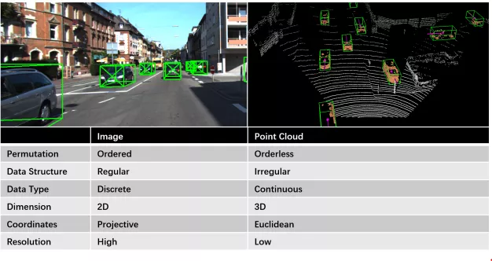

link: https://arxiv.org/abs/2004.05224

A comparison between image data and point cloud data

Tasks related to image and point cloud fusion based perception and their corresponding sections

# Depth estimation

The depth estimation model is a way to generate dense and regular depth values (point clouds) by up sampling the sparse point cloud, so that the generated point cloud is more conducive to the realization of the later perception module. 

Timeline of depth completion models and their corresponding fusion levels.

Comparative results on KITTI depth completion benchmark

# Fusion of Monocular Images and Sparse Radar Data

1. Signal level fusion
2. Feature level fusion
3. Multi-level integration

# Fusion of stereo camera and lidar

Compared with RGB images, the dense depth parallax of a stereo camera contains a richer ground truth three-dimensional geometric structure. On the other hand, the depth of lidar is sparse, but the accuracy is high. These complementary characteristics enable the depth completion model based on stereo lidar fusion to produce more accurate dense depth. However, it is worth noting that the range of the stereo camera is limited, and it will also encounter difficulties in a highly occluded, texture less environment.

# Dynamic object detection

## Sequence detection

The sequence-based model consists of a prediction phase and a three-dimensional bounding box (bbox) regression phase in chronological order. In the prediction phase, areas that may contain objects of interest are proposed. In the bbox regression stage, these suggestions are classified based on the regional features extracted from the 3D geometry. However, the performance of sequence fusion is limited by each stage.

## One stage detection

Consists of a stage where 2D and 3D data are processed in parallel

Timeline of 3D object detection networks and their corresponding fusion levels.

A comparison between three typical model architectures for dynamic object detection

A summarization and comparison between dynamic object detection models

# Road stationary target detection

Some typical model architectures and fusion methods for road/lane detection

# Semantic segmentation

The timeline of 3D semantic segmentation networks and their corresponding fusion method

Several typical model structures and fusion methods for semantic segmentation

# Multiple object tracking, MOT

MOT algorithm can be divided into two frameworks: detection-based tracking (DBT) and detection-free tracking (DFT). The DBT or tracking by detection framework uses a series of object hypotheses and higher-level clues generated by the object detector to track objects. In DBT, the target is tracked through data (detection sequence) correlation or multi-hypothesis tracking. In contrast, the DFT framework is based on finite set statistics (fist) for state estimation. Commonly used methods include multi-objective multi-Bernoulli (member) filtering and probability hypothesis density (PHD) filtering.

Comparison between detection-based tracking (DBT) and detection-free tracking (DFT) methods

# Online Cross-sensor calibration

One of the preconditions of the camera-LiDAR fusion pipeline is a flawless registration/calibration between sensors, which can be difficult to satisfy. The calibration parameters between sensors change constantly due to mechanical vibration and heat fluctuation. As most fusion methods are extremely sensitive towards calibration errors, this could significantly cripple their performance and reliability. Furthermore, offline calibration is a troublesome and time-consuming procedure.
Therefore, studies on online automatic cross-sensor calibration have significant practical benefits.

1. Classical Online Calibration
2. **DL-based Online Calibration**

# Trends, challenges

LiDAR and camera fusion is applied to improve the performance and reliability of the perception system, making driverless vehicles more capable in understanding complex scenes (e.g. urban traffic, extreme weather condition and so on).

Open Challenges Related To Performance Improvement, Reliability Enhancement

## 2D to 3D

Under the progressing of 3D feature extraction methods, to locate, track and segment objects in 3D space has become a heated area of research.

## Single-task to multi-tasks

Some recent works combined multiple complementary tasks, such as object detection, semantic segmentation and depth completion to achieve better overall performance and reduce computational costs.

## Signal-level to multi-level fusion

Early works often leverage signal-level fusion where 3D geometry is translated to the image plane to leverage off-the-shelf image processing models, while recent models try to fuse image and LiDAR in multi-level (e.g. early fusion, late fusion) and temporal context encoding.
